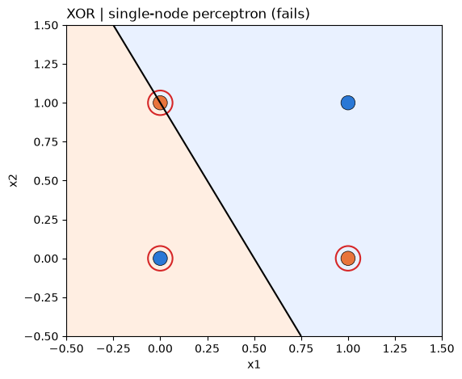
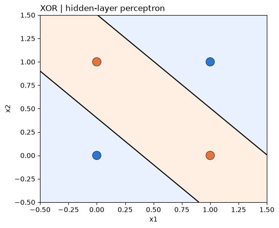
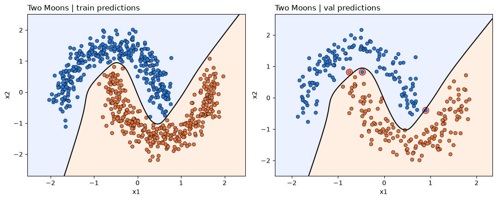
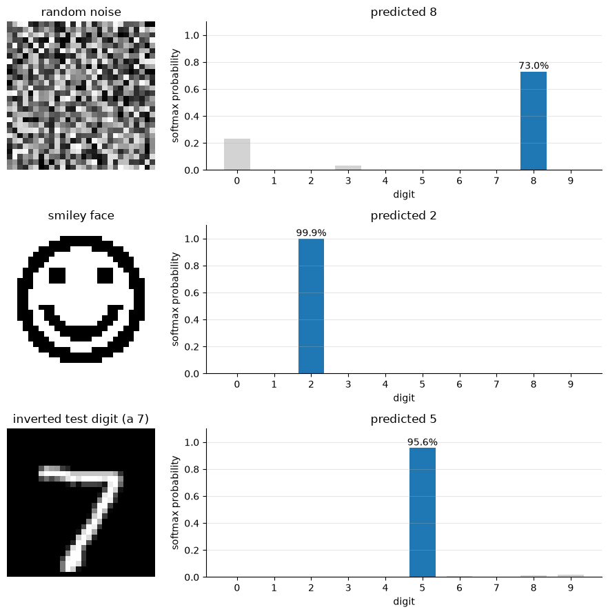

# Neural Networks from Scratch

[](https://github.com/kimdong0704/Artificial_Intelligence/actions/workflows/tests.yml)


A feed-forward neural network library written **twice**: once node by node in pure Python, and once
fully vectorized with NumPy. The two are tested against each other to give the same results. Seven
**fundamentals** notebooks build the ideas up from a single neuron to hand-written backpropagation, and
four **experiments** use the library to go from a perceptron that cannot learn XOR to a network that
classifies handwritten digits with **98% test accuracy**.

The library uses no PyTorch, TensorFlow or scikit-learn. The forward pass, backpropagation (including the
full softmax Jacobian), mini-batch gradient descent, the cost functions, the training loop and model
saving/loading are all written by hand.

## Highlights

- **Two implementations with one API.** In `loop_nn` every neuron is a `Node` object and every
  multiply-add is a Python loop. In `numpy_nn` a whole layer is one matrix multiply. Swap the import
  and the same training code runs on either.
- **Equal results, checked by tests.** From the same starting weights, both implementations produce
  the same losses, accuracies and final weights to within `1e-9` over complete training runs.
- **Backpropagation checked against numerical gradients** (finite differences) for sigmoid, identity
  and softmax + cross-entropy networks.
- **Over 200× faster when vectorized.** On MNIST-sized layers the NumPy version trains more than
  200 times faster, and gives the same numbers.
- **Classification and regression.** Softmax + cross-entropy for digits; MSE with a linear output (and
  `classifier=False`, which drops the accuracy metric) for predicting concrete strength.
- **A documented learning path**: notebooks covering neurons, baselines and metrics, gradient descent and
  backpropagation (compared against PyTorch), then experiments on linear separability, hidden layers,
  overfitting, hyper-parameters, and how a softmax classifier behaves on inputs that are not digits.

## Results

| Experiment | Problem | Network | Result |
|---|---|---|---|
| [1](notebooks/experiments/01_perceptron_logic_gates.ipynb) | AND and XOR gates | 2 → 1 (sigmoid) | AND **100%**. XOR **25%**: one node can only draw one line |
| [2](notebooks/experiments/02_hidden_layer_xor.ipynb) | XOR gate | 2 → 4 → 1 (sigmoid) | **100%**: a hidden layer makes XOR learnable |
| [3](notebooks/experiments/03_two_moons_classification.ipynb) | Two moons, 700 train / 300 validation points | 2 → 8 → 1 (sigmoid) | **100%** train, **99.0%** validation |
| [4](notebooks/experiments/04_mnist_digit_recognition.ipynb) | MNIST, 60,000 train / 10,000 test images | 784 → 300 → 10 (ReLU, softmax) | **98.0%** test (mean of 5 seeds) after 5–6 epochs; **98.5%** best |

The regression side: in [Fundamentals 7](notebooks/fundamentals/07_numpy_network_concrete_regression.ipynb) an
8 → 16 → 8 → 1 `numpy_nn` network predicts concrete compressive strength with a test MSE of **31.5**, against
**286.0** for always predicting the mean.

<table>
  <tr>
    <td></td>
    <td></td>
  </tr>
  <tr>
    <td align="center"><b>Experiment 1:</b> a single node can only draw one line, so XOR fails</td>
    <td align="center"><b>Experiment 2:</b> a hidden layer draws a band, so XOR is solved</td>
  </tr>
</table>



**Experiment 3:** the learned boundary between the two crescents. The three validation mistakes are circled.



**Experiment 4:** the MNIST network gives a confident answer even for inputs that are not digits,
including a 99.9% "2" for a smiley face.

## One API, two implementations

```python
from numpy_nn import ACTIVATIONS, COSTS, Layer, Network, random_weights, zero_bias
from numpy_trainer import DataLoader, Trainer

network = Network(
    Layer.build(784, 300, random_weights(784, 300, -0.05, 0.05), zero_bias(300), ACTIVATIONS.RELU),
    Layer.build(300, 10, random_weights(300, 10, -0.05, 0.05), zero_bias(10), ACTIVATIONS.SOFTMAX),
)

trainer = Trainer(network, cost=COSTS.CROSS_ENTROPY, learning_rate=0.3)
trainer.train(
    DataLoader(train_x, train_y, batch_size=32, shuffle=True),
    epochs=20,
    validation=(test_x, test_y),
    print_interval=1,
    stop_when=lambda epoch: epoch.accuracy >= 0.99 and epoch.validation_accuracy >= 0.97,
)

network.save("models/mnist.npz")
```

Replace `numpy_` with `loop_` and the same code runs on plain Python lists.

| | `loop_nn` / `loop_trainer` | `numpy_nn` / `numpy_trainer` |
|---|---|---|
| A layer is | a list of `Node` objects, each with its own weights | one `(outputs × inputs)` weight matrix |
| Forward pass | for each sample → for each node → for each weight | `activation(inputs @ W.T + b)` |
| Weight gradients | each node sums `dz · input` over the batch | `dz.T @ inputs` |
| Data | `list[list[float]]` | `np.ndarray` |
| Saved as | JSON | `.npz` |

[`benchmarks/compare_implementations.py`](benchmarks/compare_implementations.py) trains both on the
same data from the same starting weights:

```text
Two moons  (2 -> 8 -> 1 | batch size: 1 | epochs: 20)
  loop_nn : epoch   20 | loss: 0.0058 | accuracy: 99.43%  |    0.30 s
  numpy_nn: epoch   20 | loss: 0.0058 | accuracy: 99.43%  |    0.47 s
  largest weight difference: 1.5e-14 | numpy_nn speedup: 0.6x

MNIST slice  (784 -> 32 -> 10 | batch size: 32 | epochs: 1)
  loop_nn : epoch    1 | loss: 1.5393 | accuracy: 53.70%  |    7.26 s
  numpy_nn: epoch    1 | loss: 1.5393 | accuracy: 53.70%  |    0.03 s
  largest weight difference: 7.2e-16 | numpy_nn speedup: 216.1x
```

Vectorizing only pays off when there is enough work to vectorize. With a 2-8-1 network and one sample
per batch, NumPy's per-call overhead makes it *slower* than plain loops. With 784 inputs and batches
of 32 it is hundreds of times faster.

## How it works

Every layer computes `y = f(z)` with `z = x Wᵀ + b`, one row per sample. Training runs in two
passes, so every gradient is computed from the weights that produced the output:

1. **`network.backward(dC/dy)`** runs from the last layer to the first. Each layer turns the incoming
   delta `dC/dy` into `dC/dz` through its activation derivative, stores `∇W = dzᵀ x` and `∇b = Σ dz`,
   and passes `dz W` back to the previous layer.
2. **`network.step(learning_rate)`** then updates every layer with `W ← W − η∇W`.

Some details:

- **Softmax uses the full Jacobian**: `dz = y ⊙ (δ − ⟨δ, y⟩)`. The derivative therefore works with
  any cost, and with cross-entropy it reduces to the familiar `(y − t) / n`.
- **Numerical stability**: sigmoid is computed as `½(1 + tanh(x/2))`, so it cannot overflow. Softmax
  subtracts the row maximum first. Cross-entropy clips probabilities at `1e-12` before taking the log.
- **Non-differentiable output layers**: a `STEP` output layer passes deltas straight through, as in
  the perceptron learning rule. The trainer rejects `STEP` in hidden layers, where backpropagation
  needs a derivative.
- **BLAS threading**: mini-batch matrices are small, so the NumPy trainer limits BLAS to 4 threads.
  With the default of one thread per core, each MNIST batch was about 10× slower because the threads
  spent most of their time coordinating.

The shapes, interfaces and checks behind the design are written up in [`docs/design.md`](docs/design.md).

## Project structure

```text
src/
  numpy_nn/            vectorized network: activations, costs, initializers, Layer, Network (save/load .npz)
  numpy_trainer/       DataLoader, Trainer, accuracy metrics, Reporter (per-epoch history), plots
  loop_nn/             pure-Python network with the same modules, plus Node (a single neuron)
  loop_trainer/        the same trainer, written with loops over lists
notebooks/
  fundamentals/        01–07: from a single neuron to backpropagation by hand
  experiments/         01–04: experiments built on numpy_nn
data/                  every dataset the notebooks use (MNIST, two moons, concrete, auto MPG, …)
models/                trained MNIST networks, loadable with Network.load
reports/               write-ups for each experiment (PDF)
tests/
  test_equivalence.py  loop_nn and numpy_nn agree on forward, backward and whole training runs
  test_gradients.py    backpropagation matches finite-difference gradients
  test_training.py     XOR and a line are learned; save/load round-trips for both implementations
benchmarks/            side-by-side accuracy and speed comparison
docs/                  design notes and the figures in this README
```

## Learning path

### Fundamentals

Standalone notebooks that build the ideas the library relies on, ending with the first version of `numpy_nn`.

| # | Notebook | What it covers |
|---|---|---|
| 1 | [Data and a pretrained network](notebooks/fundamentals/01_data_and_pretrained_models.ipynb) | pandas on the wine-quality data; a pretrained VGG16 labelling photos as a black box |
| 2 | [Neurons and activation functions](notebooks/fundamentals/02_neurons_and_activation_functions.ipynb) | a neuron by hand and in NumPy, batches as matrices, hand-designed AND/OR gates |
| 3 | [Baselines, metrics and softmax](notebooks/fundamentals/03_regression_and_classification_baselines.ipynb) | the simple bias regressor and classifier, MSE, R², cross-entropy, softmax vs sigmoid |
| 4 | [Gradient descent on a linear neuron](notebooks/fundamentals/04_gradient_descent_linear_neuron.ipynb) | stochastic gradient descent fitting height → weight |
| 5 | [Backpropagation through a neuron chain](notebooks/fundamentals/05_backpropagation_neuron_chain.ipynb) | a 3-neuron chain with Leaky ReLU and He initialization predicting fuel economy |
| 6 | [Backpropagation concepts, then PyTorch](notebooks/fundamentals/06_backpropagation_with_pytorch.ipynb) | the chain rule as a sum over paths; a PyTorch regressor for concrete strength |
| 7 | [A NumPy network, backpropagation by hand](notebooks/fundamentals/07_numpy_network_concrete_regression.ipynb) | the same regressor on `numpy_nn`, with notes on the implementation and its bugs |

### Experiments

Each experiment builds its networks with `numpy_nn` and trains them with `numpy_trainer`.

- **[Experiment 1: single-node perceptron](notebooks/experiments/01_perceptron_logic_gates.ipynb).** One sigmoid
  node learns AND but cannot learn XOR: it gets stuck with every output near 0.5 and three of the four
  points wrong. ([report](reports/01_perceptron_logic_gates.pdf))
- **[Experiment 2: hidden-layer perceptron](notebooks/experiments/02_hidden_layer_xor.ipynb).** Adding a hidden
  layer of four units solves XOR. The loss curve shows the usual slow start followed by a sharp drop once
  the hidden units specialise. ([report](reports/02_hidden_layer_xor.pdf))
- **[Experiment 3: two moons](notebooks/experiments/03_two_moons_classification.ipynb).** On 700 training and
  300 validation points the network fits the training set perfectly and reaches 99.0% on validation.
  Validation loss is lowest at epoch 26 and rises slowly after that, which shows the onset of
  overfitting. ([report](reports/03_two_moons_classification.pdf))
- **[Experiment 4: MNIST](notebooks/experiments/04_mnist_digit_recognition.ipynb).** A 784-300-10 ReLU/softmax
  network trained on all 60,000 images with mini-batch SGD and cross-entropy.
  ([report](reports/04_mnist_digit_recognition.pdf))
  - *Hyper-parameters*: a sweep over hidden size (25 / 256 / 1024), initial weight range (all
    positive, all negative, or both signs) and learning rate. When all the starting weights share one
    sign, the network never learns in 20 epochs: it stays at about 10% accuracy, no better than guessing.
  - *Input curation*: turning grey pixels into pure black and white reaches the accuracy target faster
    (5.0 vs 5.6 epochs) but lowers test accuracy for every one of the 5 seeds (97.64% vs 98.01%).
  - *Training too long*: after 100 epochs training accuracy is 100%, but test loss has been rising
    since epoch 10, while test accuracy stays flat at about 98.5%.
  - *Non-digit inputs*: noise, a smiley face and an inverted 7 are each assigned a digit with 73–99.9%
    confidence. A softmax classifier has no way to say "none of the above".

## Getting started

```bash
git clone https://github.com/kimdong0704/Artificial_Intelligence.git
cd Artificial_Intelligence
pip install -e ".[dev,notebooks]"

pytest                                      # 22 tests
python benchmarks/compare_implementations.py
jupyter lab notebooks/
```

The notebooks find the repository root and add `src/` to `sys.path` themselves, so they also run without
installing the package. The library itself needs only NumPy, Matplotlib and threadpoolctl; the
`notebooks` extra adds pandas and, for the fundamentals notebooks that compare against it, PyTorch.

Experiments 1–3 each run in seconds. Experiment 4 retrains several MNIST networks and takes a while; its
trained models are included in [`models/`](models), so the non-digit probe at the end can load them without
retraining. The ten photos used in Fundamentals 1 are not included (the notebook keeps the outputs of its
original run).
